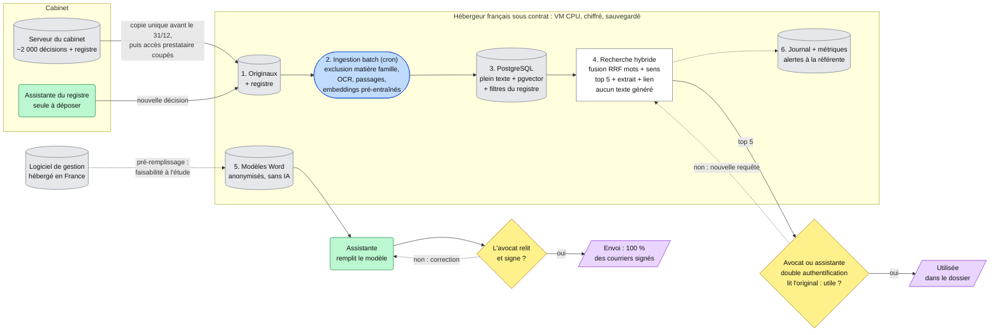

# Fiche de décision — <votre cas> (À COMPLÉTER)

**Client :** <nom, rôle> · **Groupe :** <prénoms> · **Cas <A/C/D>**

> **Livrable principal — 3-4 pages au maximum** (un plafond, pas une cible).
> Lisible par un architecte technique. Renommez en `dossier_conception.md`.
> Tout s'écrit **ici, une seule fois** : décisions, arbitrages, schéma et
> questions prévues. Tableaux plutôt que paragraphes.

---

## 1. Décisions de groupe (mardi 15h30-16h45)

> 3-5 points où vos cadrages M8-B1 divergeaient. Pas de compromis mou : un
> choix tranché et argumenté.

| Divergence | Positions (qui pensait quoi) | Décision retenue | Pourquoi |
| --- | --- | --- | --- |
| Périmètre du projet | <ul><li>Franck et Étienne : interface de recherche utilisée par les assistantes pour retrouver les décisions, les trier manuellement et conserver les jurisprudences utiles à la rédaction des documents.</li><li>Nawelle : recherche et modèles de courriers préremplis, avec récupération des informations du logiciel de gestion si son éditeur le permet.</li></ul> | Limiter le projet à une **interface de recherche** avec d'autre part des **modèles préremplis**. | Une intervention humaine est nécessaire pour filtrer les résultats ; les informations disponibles ne permettent pas de confirmer la faisabilité de l'automatisation des courriers. |
| Recherche hybride vs recherche par mots-clés | <ul><li>Nawelle : recherche par mots-clés, solution minimale qui peut être suffisante.</li><li>Étienne et Franck : recherche hybride, combinant mots-clés et mots apparentés par le sens pour ne rien rater.</li></ul> | **Recherche hybride** | Augmenter le rappel pour ne rater aucun DOC. |
| Solution pour gagner du temps sur le courrier | <ul><li>Étienne : modèles Word préremplis avec des champs à remplir.</li><li>Franck : pas de solution.</li><li>Nawelle : modèles Word préremplis avec des champs à remplir et récupération des informations du logiciel de gestion pour préremplir les documents.</li></ul> | Proposer des **modèles Word** au client et **étudier la faisabilité d'un lien avec le logiciel de gestion**. | Solution simple sans IA pour gagner du temps sur le courrier. |
| KPI de recherche | <ul><li>Étienne : passer de 30 minutes à moins d'une minute par recherche ; la décision recherchée doit figurer parmi les 5 premiers résultats.</li><li>Nawelle : seuil de rappel de 80 % pour revoir la solution, tolérance à l'invention de 0, signature humaine de 100 % des courriers ; objectif d'1 h gagnée par avocat jugé irréaliste, avec environ 5 h de recherche par jour estimées.</li><li>Franck : passer de 30 minutes à 30 secondes par recherche, 75 % de précision et 95 % de rappel.</li></ul> | **30 secondes par recherche** (tolérance : **quelques minutes**) + **décision recherchée dans les 5 premiers résultats**. | Mesurer le temps et la qualité de chaque recherche ; le gain quotidien dépend du nombre de recherches par avocat. |
| Anonymisation / pseudonymisation | <ul><li>Franck : anonymisation ou pseudonymisation lors de la préparation des données.</li><li>Étienne et Nawelle : aucune anonymisation ou pseudonymisation proposée dans leurs cadrages.</li></ul> | **Anonymiser les modèles de courriers** ; conserver les **décisions sans anonymisation** ; disposer d'un **jeu de test pour les embeddings 100 % anonyme**. | L'anonymisation complète des décisions représente trop de travail. Celle des modèles de courriers est importante car les modèles seront réutilisés constamment et ne doivent donc pas contenir de données personnelles. |

## 2. Les 5 arbitrages

> Pour chacun : **choix + raisons (≥ 1 chiffrée) + condition de changement
> d'avis** — ou « non applicable » en une ligne justifiée (+ ce qui ferait se
> poser la question). Répondre « SLM » ou « RAG » sur un cas sans texte pour
> remplir la grille est un signal de tropisme.

| Arbitrage | Choix — ou « non applicable » | Raisons (≥ 1 chiffrée) | On changerait d'avis si… |
| --- | --- | --- | --- |
| ML classique vs deep learning | **Deep learning pré-entraîné, sans aucun entraînement** : un modèle d'embeddings sert pour la partie sémantique de la recherche hybride. Aucun modèle ML classique, faute de tâche de prédiction | Aucun label de sujet juridique : le registre ne donne que matière, date et issue, donc rien à apprendre. Avec ~2 000 décisions, c'est trop peu pour entraîner un modèle de langue, mais assez peu pour les vectoriser en quelques minutes sur CPU (~10-50 ms par document, coût ~0 €) | On voudrait **classer automatiquement les nouvelles décisions par matière** → ML classique (TF-IDF + régression logistique) entraîné sur les matières déjà saisies dans le registre |
| SLM vs LLM | **Non applicable** : aucun texte généré, l'outil affiche des décisions réelles et des modèles Word | Tolérance à l'invention : **0** (« Ça, jamais chez nous », Q7). Un SLM hébergé en France sur GPU coûterait **300 à 1 500 € par mois**, hors du budget de « quelques centaines d'euros par mois » (Q8) | Le cabinet demande des **résumés de décisions** → SLM hébergé en France, en **batch une seule fois** sur les ~2 000 décisions (pas de GPU permanent), avec relecture humaine |
| RAG oui / non | **Non** : on garde le *retrieval* (recherche hybride), **sans génération**. Le résultat est une liste des 5 meilleures décisions avec le lien vers l'original | Le besoin est de **retrouver un document** (~10 recherches par jour, soit ~220 par mois), pas d'obtenir une réponse rédigée. Sans génération : aucune invention possible, et pas de prompt injection via des conclusions adverses indexées | Les avocats demandent une **synthèse de plusieurs décisions** **et** le KPI (décision dans les 5 premiers résultats) est déjà atteint → RAG avec citation obligatoire des sources, une nouvelle analyse AI Act (art. 50) et un filtrage du corpus contre l'injection |
| Agents oui / non | **Non** : une recherche correspond à une requête, et un courrier à un modèle rempli. Il n'y a pas de chaîne d'actions à orchestrer | ~15 courriers par jour, **100 % relus et signés par un avocat** (Q3) : l'envoi est irréversible et engage la responsabilité professionnelle. Un agent ajouterait des droits d'écriture sans aucun gain | **Jamais pour l'envoi.** On reposerait la question seulement pour un enchaînement en **lecture seule** (par exemple recherche puis ouverture du dossier dans le logiciel de gestion), avec des droits minimaux |
| Zero-shot suffit ? | **Oui** : les embeddings pré-entraînés sont utilisés **tels quels**, sans fine-tuning | **0** paire « question → bonne décision » existe aujourd'hui, donc démarrage à froid. Le jeu de test (30 recherches réelles, anonymisé, cf. §1) sert **à mesurer, pas à entraîner** | Sur le jeu de test, **moins de 80 % des recherches** trouvent la bonne décision dans les 5 premiers résultats → modèle d'embeddings **spécialisé en droit français**, puis fine-tuning si l'on collecte quelques centaines de paires validées |

## 3. Architecture finale et sobriété



- **Hébergeur, 1 et 6** : imprévu de mardi (prestataire parti le 31/12) : rien ne tourne au cabinet, copie des décisions avant son départ, journal suivi par l'hébergeur avec alertes à la référente du cabinet.
- **2 et 3** : exclusion du droit de la famille dès l'ingestion (Q1, 25 % de l'extrait du registre) ; arbitrages 1 et 5 : embeddings pré-entraînés utilisés tels quels, sur CPU, sans entraînement ; texte, filtres et vecteurs dans une seule base (≈ 40 000 passages × 384 dimensions × 4 octets ≈ 60 Mo).
- **4** : §1 (recherche hybride) et arbitrages 2 et 3 : on renvoie 5 décisions réelles avec le lien vers l'original, jamais un texte généré.
- **5 et losanges** : §1 (courriers, anonymisation) et arbitrage 4 : modèles Word sans IA, chaque résultat lu et chaque courrier signé par un humain.

**Ce qu'on n'a PAS mis (obligatoire)** :

- **Pas de LLM, de SLM ni de RAG génératif** (arbitrages 2 et 3) : tolérance à l'invention de 0 ; un GPU coûterait 300 à 1 500 € par mois, hors budget.
- **Pas de base vectorielle dédiée** : ≈ 60 Mo de vecteurs tiennent dans la base PostgreSQL déjà nécessaire (pgvector) ; sans prestataire après le 31/12, chaque logiciel en moins est une panne en moins.
- **Pas d'agent** (arbitrage 4) : l'envoi d'un courrier est irréversible, il reste 100 % humain.
- **Pas d'entraînement, de fine-tuning ni de registre de modèles (MLflow Registry)** (arbitrages 1 et 5) : un seul modèle, figé, aucune paire labellisée ; il ne change qu'après le jeu de test (§2).
- **Pas de GPU ni d'orchestrateur (Kubernetes, Airflow)** : indexation complète une seule fois sur CPU (≈ 40 000 passages × 10-50 ms ≈ 7 à 35 min), puis ≈ 130 nouvelles décisions par an ajoutées par une tâche de nuit (cron).
- **Pas de reclassement par un 2e modèle (reranker)** : un modèle de plus à héberger ; à ajouter seulement si le jeu de test montre la bonne décision dans le top 10 mais hors du top 5.
- **Pas d'installation au cabinet ni de cloud américain** : plus personne pour l'entretenir après le 31/12 ; dossiers sous secret, exigence du client (Cloud Act).

## 4. Évaluation

**Ce qu'on compare** (même index, même jeu de test) :

| | Système | Rôle |
|---|---|---|
| **Référence actuelle** | Nom de fichier ou « demander au collègue » | Point de départ du KPI : environ 30 min par recherche |
| **Baseline à battre** | **Mots-clés seuls** (plein texte PostgreSQL) + filtres du registre | La solution la plus légère : sans aucun modèle d'IA |
| **Candidat** | **Recherche hybride** (mots-clés + sens, fusion RRF) | La solution retenue au §1 |

**Jeu de test** : 30 recherches réelles, collectées par les assistantes pendant la semaine de mesure. Chacune est notée **telle que l'avocat l'a tapée**, avec la ou les décisions attendues (**leur numéro au registre**), validées par l'avocat. Les questions sont anonymisées (§1).
- **Composition** : environ 15 en recouvrement et environ 15 en baux commerciaux ; au moins **10 visant des scans anciens** (pour tester l'OCR) ; au moins **10 formulées sans les mots exacts de la décision** (« expulsion » pour « résiliation du bail »), là où l'hybride doit faire la différence.
- **Découpage** : rien n'est entraîné, mais on règle des paramètres (taille des passages, poids de la fusion). On utilise **10 recherches pour le réglage** et on garde **20 recherches jamais vues** pour la mesure finale, pour ne pas se mesurer sur ce qu'on a ajusté.
- **Axe temporel** : les 20 recherches de mesure portent sur des décisions réparties sur les 15 ans d'archive. On vérifie que les décisions anciennes, scannées, ne sont pas systématiquement ratées.

**Métriques, alignées sur le KPI du §1 (« décision dans les 5 premiers résultats, en 30 s »)** :

| Métrique | Ce qu'elle dit au cabinet | Seuil de mise en service |
|---|---|---|
| **Rappel@5** : part des recherches où une décision attendue est dans le top 5 | « Je trouve ma décision sans chercher plus loin » | **≥ 80 %** sur les 20 recherches de mesure |
| Rappel@5 par sous-groupe (scans anciens, formulations différentes) | Où l'outil rate | Aucun sous-groupe **< 60 %** |
| **Temps pour trouver**, chronométré avec 3 utilisateurs | Le KPI métier | Médiane **≤ 30 s** ; tolérance : quelques minutes |
| Résultats sans document original (lien cassé ou texte généré) | Zéro invention (Q7) | **0** |
| Décisions de droit de la famille dans les résultats | Exclusion demandée (Q1) | **0** |
| **Décisions consultables** : décisions lisibles et indexées ÷ décisions inscrites au registre | L'outil couvre bien l'archive (OCR) | **≥ 90 %** ; les autres vont sur la liste à re-numériser |

**Règle de décision** :
- **Hybride ≥ baseline + 10 points de Rappel@5** → on garde l'hybride.
- **Moins de 10 points d'écart** → on **revient aux mots-clés seuls**, plus simples à maintenir sans prestataire.
- **Rappel@5 < 80 % pour les deux** → modèle d'embeddings spécialisé en droit français (arbitrage 5), ou reranker si la bonne décision est dans le top 10 mais pas dans le top 5 (§3).
- **L'outil n'ouvre que si tous les seuils sont atteints.** Le même jeu de test est **rejoué à chaque changement** (nouveau modèle, autre découpage des passages) : si le score baisse, **retour à la version précédente** (§5).

**Courriers** : on refait **10 courriers récents** avec les nouveaux modèles Word et on les compare à l'ancienne méthode (copier-coller). Mesures : temps par courrier, **0 erreur de montant ou de délai** après relecture de l'avocat.

## 5. Déploiement et monitoring (héritage M5 / M6)

**Où ça tourne** : une VM CPU chez l'hébergeur français, trois conteneurs via docker-compose (base, application, tâche de nuit). Par **contrat d'infogérance**, l'hébergeur assure mises à jour, sauvegarde quotidienne et surveillance (imprévu du 31/12) ; les alertes partent par e-mail. **Retour arrière** : versions étiquetées ; une nouvelle ne passe qu'après le rejeu du jeu de test (§4), sinon on redéploie la précédente (runbook).

| Question | Métrique | Seuil | Alerte vers |
| --- | --- | --- | --- |
| En vie ? | Healthcheck + temps de réponse | Panne > 5 min ou réponse > 2 s | Hébergeur, copie à la référente |
| Trouve bien ? | Part des recherches où un des 5 résultats est ouvert (agrégée, jamais par personne) | < 80 % sur le mois | Référente + Maître Devalle |
| Données qui dérivent ? | Décisions du registre non indexées (illisibles ou en erreur) | > 10 % des dépôts du mois | Assistante du registre |

**Réentraînement** : aucun, le modèle est figé et seul l'index grandit chaque nuit. On surveille la dérive sur les dépôts et les recherches. Si « Trouve bien ? » passe sous 80 %, on teste un modèle spécialisé en droit (§2) sur le jeu de test, adopté seulement s'il fait mieux (promotion conditionnelle) ; la référente et Maître Devalle décident.

## 6. Conformité et sécurité

**Usage réel** : un avocat ou une assistante tape une recherche. L'outil **classe** 5 décisions réelles du cabinet et affiche le lien vers l'original. L'humain lit et décide seul. Pour les courriers, l'assistante remplit un modèle Word et l'avocat relit et signe. L'outil **ne décide rien et ne rédige rien**.

**AI Act : pas de haut risque, aucune obligation spécifique** hormis la maîtrise de l'IA par les équipes (art. 4 : une courte formation sur « ce que fait et ne fait pas la recherche par le sens »). Les embeddings classent des résultats, donc l'outil est probablement un *système d'IA* au sens de l'art. 3. Le cabinet en est le **déployeur**.
- **Annexe III 8 a non applicable** : elle vise l'IA utilisée *par une autorité judiciaire* ou en son nom, et un cabinet d'avocats n'en est pas une.
- **Art. 50 non applicable** : pas de chatbot, aucun contenu généré.
- **Bascule** :
  1. les statistiques de recherche ou le champ « issue » servent à **évaluer les avocats** → Annexe III 4 b, haut risque. C'est pour ça que le monitoring est **agrégé, jamais par personne** (§5) ;
  2. l'outil **prédit l'issue d'un litige** ;
  3. on ajoute de la **génération** (RAG) → art. 50 et nouvelle analyse.

**RGPD** : le cabinet est **responsable de traitement**. L'hébergeur, qui assure aussi l'infogérance et a donc accès aux données, est **sous-traitant** : il signe un contrat art. 28 et fournit des garanties de non-soumission à un droit extra-européen (exigence Q10 ; idéalement une offre qualifiée SecNumCloud).
- **Base légale : intérêt légitime (art. 6.1.f)**, à savoir réutiliser sa propre production pour mieux défendre ses clients. Le **consentement** est écarté (impossible auprès des parties adverses), tout comme le **contrat** (les adversaires ne sont pas clients). La mise en balance et la **compatibilité avec la finalité d'origine** (art. 6.4) sont documentées : données déjà détenues légalement, usage interne, secret professionnel.
- **Minimisation, inscrite dans l'architecture** : droit de la famille **exclu à l'ingestion** (Q1), modèles Word et jeu de test **anonymisés** (§1), monitoring agrégé.
- **Information des personnes** : exception de l'art. 14.5 d (secret professionnel).
- **Profilage** : non. **Art. 22** : non applicable, aucune décision n'est exclusivement automatisée.
- **AIPD recommandée** : 15 ans de dossiers sous secret professionnel, des situations financières de débiteurs, et un nouvel hébergement.

**Sécurité** — exposition : une application web chez l'hébergeur, accessible aux 12 avocats et aux assistantes, sans API publique, sans LLM et sans réentraînement.

| Menace | Plausibilité sur CE cas | Réponse d'architecture | Risque résiduel |
| --- | --- | --- | --- |
| **Exfiltration** via le moteur (extraction massive de décisions) | 🟠 15 ans de dossiers confidentiels réunis en un point de recherche | Comptes nominatifs + **double authentification**, limite d'ouvertures et d'exports, alerte sur volume anormal (journal §5) | Un utilisateur autorisé et mal intentionné |
| **Compte compromis** (hameçonnage), application exposée sur Internet | 🟠 Petit cabinet, aucun informaticien en interne | Double authentification, accès réservé à l'IP du cabinet ou à un VPN, mises à jour par l'infogérance | Hameçonnage qui contourne la double authentification |
| **Accès de l'ancien prestataire** après le 31/12 (imprévu) | 🟠 Il connaît le serveur et ses mots de passe | Copie chiffrée avant son départ, puis **révocation de tous ses accès** et changement des mots de passe | Un accès oublié : audit des comptes en janvier |
| **Empoisonnement de l'index** (document piégé ou mal classé) | 🟡 Le serveur n'est plus administré | Dépôt **réservé à l'assistante du registre**, filtre de matière à l'ingestion | Erreur de classement non repérée |
| **Modèle d'embeddings piégé** (téléchargement) | 🟡 Le modèle vient d'un dépôt public | Source reconnue, format *safetensors*, version figée et vérifiée (empreinte) | Faille inconnue dans le modèle |

**Écartés en une ligne** :
- **Prompt injection** : ⚪ sans objet, aucun LLM ne lit les documents. Elle deviendrait 🟠 avec un RAG, à cause des conclusions adverses indexées.
- **Vol de modèle et adversarial** : ⚪ le modèle est public et ne contient rien du cabinet, et personne n'a intérêt à tromper le classement.
- **Inversion des embeddings** : ⚪ le texte en clair est déjà dans la même base. C'est **la base** qu'on protège (chiffrement au repos, sauvegarde chiffrée).

## 7. Coûts (ordres de grandeur, sur VOTRE volumétrie)

<!-- ressources/fiche_chiffrage.md — à recalculer, pas à recopier. -->

| Poste | Estimation | Hypothèse |
| --- | --- | --- |
|  |  |  |

---

## ⭐ Optionnel — Pseudo-code du composant critique

Composant critique : la **recherche hybride** (bloc 4 du §3).

```text
fonction rechercher(requete, utilisateur, filtres_registre):
    si non utilisateur.double_authentification_valide:
        journal_securite("accès refusé", utilisateur) ; refuser
    si utilisateur.ouvertures_du_jour > plafond:               # exfiltration (§6)
        alerter(referente) ; bloquer

    requete ← normaliser(tronquer(requete, 300 caractères))
    par_mots ← index_plein_texte.chercher(requete, filtres_registre, 50)
    par_sens ← index_vecteurs.plus_proches(embedding(requete), filtres_registre, 50)
    passages ← fusion_RRF(par_mots, par_sens)                 # rangs fusionnés, pas de score inventé

    decisions ← regrouper_par_decision(passages)               # plusieurs passages → 1 décision
    garder seulement d où d.matiere ≠ "famille"                # garde-fou, déjà exclu à l'ingestion
                         et utilisateur.peut_voir(d)
                         et fichier_existe(d.lien_original)   # sinon journal "lien cassé"
    top5 ← 5 premières decisions

    si top5 est vide:
        afficher "Aucune décision trouvée : essayez d'autres mots ou demandez à l'assistante du registre"
    journal_securite(utilisateur, nb_resultats)                # accès restreint, conservation limitée
    metriques_agregees(nb_resultats, temps_reponse)            # jamais par personne, jamais le texte de la requête
    retourner top5 en (numéro registre, date, matière, extrait surligné, lien vers l'original)
    # aucun texte généré : chaque ligne renvoie à un document réel
```

## Annexe — 5 questions prévues (hors pagination)

| # | Question probable | Réponse préparée (2-3 lignes) | Qui répond |
| --- | --- | --- | --- |
| 1 |  |  |  |
| 2 |  |  |  |
| 3 |  |  |  |
| 4 |  |  |  |
| 5 |  |  |  |
