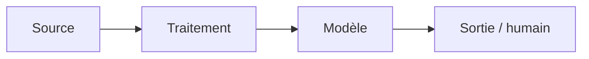

# Fiche de décision — <votre cas> (À COMPLÉTER)

**Client :** <nom, rôle> · **Groupe :** <prénoms> · **Cas <A/C/D>**

> **Livrable principal — 3-4 pages au maximum** (un plafond, pas une cible).
> Lisible par un architecte technique. Renommez en `dossier_conception.md`.
> Tout s'écrit **ici, une seule fois** : décisions, arbitrages, schéma et
> questions prévues. Tableaux plutôt que paragraphes.

---

## 1. Décisions de groupe (mardi 15h30-16h45)

> 3-5 points où vos cadrages M8-B1 divergeaient. Pas de compromis mou : un
> choix tranché et argumenté.

| Divergence | Positions (qui pensait quoi) | Décision retenue | Pourquoi |
| --- | --- | --- | --- |
| Périmètre du projet | <ul><li>Franck et Étienne : interface de recherche utilisée par les assistantes pour retrouver les décisions, les trier manuellement et conserver les jurisprudences utiles à la rédaction des documents.</li><li>Nawelle : recherche et modèles de courriers préremplis, avec récupération des informations du logiciel de gestion si son éditeur le permet.</li></ul> | Limiter le projet à une **interface de recherche** avec d'autre part des **modèles préremplis**. | Une intervention humaine est nécessaire pour filtrer les résultats ; les informations disponibles ne permettent pas de confirmer la faisabilité de l'automatisation des courriers. |
| Recherche hybride vs recherche par mots-clés | <ul><li>Nawelle : recherche par mots-clés, solution minimale qui peut être suffisante.</li><li>Étienne et Franck : recherche hybride, combinant mots-clés et mots apparentés par le sens pour ne rien rater.</li></ul> | **Recherche hybride** | Augmenter le rappel pour ne rater aucun DOC. |
| Solution pour gagner du temps sur le courrier | <ul><li>Étienne : modèles Word préremplis avec des champs à remplir.</li><li>Franck : pas de solution.</li><li>Nawelle : modèles Word préremplis avec des champs à remplir et récupération des informations du logiciel de gestion pour préremplir les documents.</li></ul> | Proposer des **modèles Word** au client et **étudier la faisabilité d'un lien avec le logiciel de gestion**. | Solution simple sans IA pour gagner du temps sur le courrier. |
| KPI de recherche | <ul><li>Étienne : passer de 30 minutes à moins d'une minute par recherche ; la décision recherchée doit figurer parmi les 5 premiers résultats.</li><li>Nawelle : seuil de rappel de 80 % pour revoir la solution, tolérance à l'invention de 0, signature humaine de 100 % des courriers ; objectif d'1 h gagnée par avocat jugé irréaliste, avec environ 5 h de recherche par jour estimées.</li><li>Franck : passer de 30 minutes à 30 secondes par recherche, 75 % de précision et 95 % de rappel.</li></ul> | **30 secondes par recherche** (tolérance : **quelques minutes**) + **décision recherchée dans les 5 premiers résultats**. | Mesurer le temps et la qualité de chaque recherche ; le gain quotidien dépend du nombre de recherches par avocat. |
| Anonymisation / pseudonymisation | <ul><li>Franck : anonymisation ou pseudonymisation lors de la préparation des données.</li><li>Étienne et Nawelle : aucune anonymisation ou pseudonymisation proposée dans leurs cadrages.</li></ul> | **Anonymiser les modèles de courriers** ; conserver les **décisions sans anonymisation** ; disposer d'un **jeu de test pour les embeddings 100 % anonyme**. | L'anonymisation complète des décisions représente trop de travail. Celle des modèles de courriers est importante car les modèles seront réutilisés constamment et ne doivent donc pas contenir de données personnelles. |

## 2. Les 5 arbitrages

> Pour chacun : **choix + raisons (≥ 1 chiffrée) + condition de changement
> d'avis** — ou « non applicable » en une ligne justifiée (+ ce qui ferait se
> poser la question). Répondre « SLM » ou « RAG » sur un cas sans texte pour
> remplir la grille est un signal de tropisme.

| Arbitrage | Choix — ou « non applicable » | Raisons (≥ 1 chiffrée) | On changerait d'avis si… |
| --- | --- | --- | --- |
| ML classique vs deep learning | **Deep learning pré-entraîné, sans aucun entraînement** : un modèle d'embeddings sert pour la partie sémantique de la recherche hybride. Aucun modèle ML classique, faute de tâche de prédiction | Aucun label de sujet juridique : le registre ne donne que matière, date et issue, donc rien à apprendre. Avec ~2 000 décisions, c'est trop peu pour entraîner un modèle de langue, mais assez peu pour les vectoriser en quelques minutes sur CPU (~10-50 ms par document, coût ~0 €) | On voudrait **classer automatiquement les nouvelles décisions par matière** → ML classique (TF-IDF + régression logistique) entraîné sur les matières déjà saisies dans le registre |
| SLM vs LLM | **Non applicable** : aucun texte généré, l'outil affiche des décisions réelles et des modèles Word | Tolérance à l'invention : **0** (« Ça, jamais chez nous », Q7). Un SLM hébergé en France sur GPU coûterait **300 à 1 500 € par mois**, hors du budget de « quelques centaines d'euros par mois » (Q8) | Le cabinet demande des **résumés de décisions** → SLM hébergé en France, en **batch une seule fois** sur les ~2 000 décisions (pas de GPU permanent), avec relecture humaine |
| RAG oui / non | **Non** : on garde le *retrieval* (recherche hybride), **sans génération**. Le résultat est une liste des 5 meilleures décisions avec le lien vers l'original | Le besoin est de **retrouver un document** (~10 recherches par jour, soit ~220 par mois), pas d'obtenir une réponse rédigée. Sans génération : aucune invention possible, et pas de prompt injection via des conclusions adverses indexées | Les avocats demandent une **synthèse de plusieurs décisions** **et** le KPI (décision dans les 5 premiers résultats) est déjà atteint → RAG avec citation obligatoire des sources, une nouvelle analyse AI Act (art. 50) et un filtrage du corpus contre l'injection |
| Agents oui / non | **Non** : une recherche correspond à une requête, et un courrier à un modèle rempli. Il n'y a pas de chaîne d'actions à orchestrer | ~15 courriers par jour, **100 % relus et signés par un avocat** (Q3) : l'envoi est irréversible et engage la responsabilité professionnelle. Un agent ajouterait des droits d'écriture sans aucun gain | **Jamais pour l'envoi.** On reposerait la question seulement pour un enchaînement en **lecture seule** (par exemple recherche puis ouverture du dossier dans le logiciel de gestion), avec des droits minimaux |
| Zero-shot suffit ? | **Oui** : les embeddings pré-entraînés sont utilisés **tels quels**, sans fine-tuning | **0** paire « question → bonne décision » existe aujourd'hui, donc démarrage à froid. Le jeu de test (30 recherches réelles, anonymisé, cf. §1) sert **à mesurer, pas à entraîner** | Sur le jeu de test, **moins de 80 % des recherches** trouvent la bonne décision dans les 5 premiers résultats → modèle d'embeddings **spécialisé en droit français**, puis fine-tuning si l'on collecte quelques centaines de paires validées |

## 3. Architecture finale et sobriété



<!-- Chaque brique découle d'un arbitrage. Commentez en 3-4 lignes. -->

**Ce qu'on n'a PAS mis (obligatoire)** : <!-- brique écartée + raison, ex. « pas de vector DB : RAG = non » -->

## 4. Évaluation

<!-- Comment on saura que ça marche AVANT la mise en service :
     baseline simple à battre, découpage des données (temporel si le temps compte),
     métriques alignées sur le KPI métier du cadrage. -->

## 5. Déploiement et monitoring (héritage M5 / M6)

<!-- Où et comment ça tourne, rollback. Puis : -->

| Question | Métrique | Seuil | Alerte vers |
| --- | --- | --- | --- |
| En vie ? |  |  |  |
| Prédit bien ? |  |  |  |
| Données qui dérivent ? |  |  |  |

<!-- Quand réentraîner, et qui décide. -->

## 6. Conformité et sécurité

<!-- Qualification AI Act et base légale RGPD reprises des cadrages (raisonnement,
     pas étiquette), en tenant compte de l'imprévu client de mardi 14h30.
     Chaque menace de sécurité retenue → sa réponse d'architecture + le risque résiduel. -->

## 7. Coûts (ordres de grandeur, sur VOTRE volumétrie)

<!-- ressources/fiche_chiffrage.md — à recalculer, pas à recopier. -->

| Poste | Estimation | Hypothèse |
| --- | --- | --- |
|  |  |  |

---

## ⭐ Optionnel — Pseudo-code du composant critique

```text
fonction <nom>(<entrées>):
    # 10-20 lignes : cas nominal, cas limite (donnée manquante, confiance basse…),
    # ce qui est journalisé.
```

## Annexe — 5 questions prévues (hors pagination)

| # | Question probable | Réponse préparée (2-3 lignes) | Qui répond |
| --- | --- | --- | --- |
| 1 |  |  |  |
| 2 |  |  |  |
| 3 |  |  |  |
| 4 |  |  |  |
| 5 |  |  |  |
